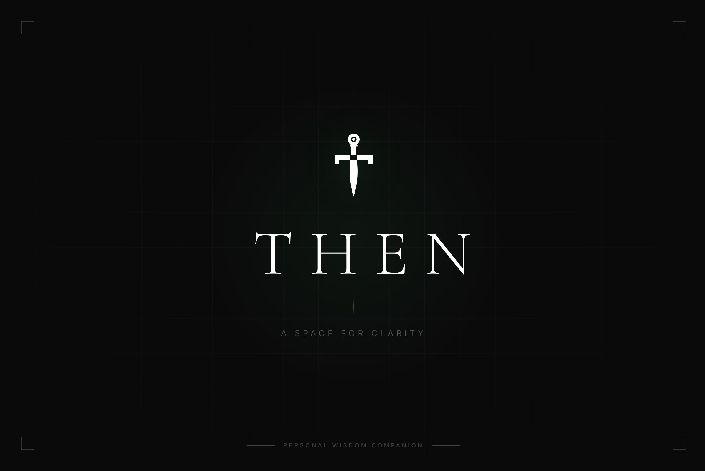

# ⚔️ Then — Personal Wisdom Companion

> *A space to think out loud, untangle decisions, and leave with more certainty than you came with.*

Then is a full-stack AI companion built for clarity. Not a chatbot, not a search engine — a space to think out loud, untangle decisions, and leave with more certainty than you came with. Built on Python and the Anthropic API with real-time streaming, persistent memory that learns who you are across conversations, and a dark minimal UI designed around one idea: get clear, then go.

---

<p align="center">
  
</p>

## 🗡️ What Then Does

- **Thinks with you** — not at you. No bullet points, no therapy speak, no corporate warmth
- **Remembers who you are** — ghost memory extracts personality observations across conversations
- **Streams responses in real time** — no waiting for the full answer to load
- **Learns your name** — first-launch onboarding, used naturally like a friend
- **Quote & reply** — highlight any part of a response and ask Then about it directly
- **Works offline-first** — runs entirely on your machine, your API key, your data

---

## 🏰 Prerequisites

Before you begin, make sure you have:

| Requirement | How to check |
|---|---|
| Python 3.8+ | `python --version` |
| An Anthropic API key | [console.anthropic.com](https://console.anthropic.com) |
| A modern browser | Chrome, Firefox, Edge |

> No Node.js required. No external Python packages. The server runs on Python's built-in libraries only.

---

## ⚙️ Installation & Setup

**1. Clone the repository**
```bash
git clone https://github.com/Abdul7602/then.git
cd then
```

**2. That's it.** No `npm install`. No `pip install`. No config files.

---

## 🚀 Launching Then

**Start the server:**
```bash
python server.py
```

You should see:
Then is running → http://localhost:3000  
(Press Ctrl+C to stop)

**Open your browser and go to:**
http://localhost:3000

---

## 🔑 Adding Your API Key

1. On first launch, Then will ask for your name
2. Click the **Settings** icon in the bottom-left sidebar
3. Paste your Anthropic API key (`sk-ant-...`)
4. Hit Save — you're ready

> Your API key is stored locally in your browser. It never leaves your machine except to call the Anthropic API directly.

---

## 🧪 Testing It Out

Once running, try these:

- **Start a conversation** — type anything weighing on you and hit Enter
- **Quote & reply** — highlight any text in a response, click **Ask Then**
- **Search conversations** — click *Search chats* in the sidebar
- **New chat** — click *New chat* to start fresh
- **Collapse sidebar** — click the panel icon top-right of the sidebar

---

## 🗂️ Project Structure
then/
├── server.py          # Python server — no dependencies, runs everything
├── server.js          # Node.js alternative server (optional)
├── public/
│   ├── index.html     # Entire frontend — single file, all CSS + JS inline
│   └── sw.js          # Service worker for background notifications
├── logo/              # Brand assets — SVG wordmark, sword icon, portfolio card
└── package.json       # Only needed if running Node.js server

---

## 🛠️ Tech Stack

| Layer | Technology |
|---|---|
| Server | Python 3 (built-in `http.server`) |
| AI | Anthropic API — Claude Opus |
| Frontend | Vanilla JS + CSS — single HTML file |
| Storage | Browser `localStorage` |
| Streaming | Server-Sent Events (SSE) |

---

## 🧠 How the Memory Works

Then has two types of memory:

- **Conversation history** — every chat is saved locally and shown in the sidebar
- **Ghost memory** — after meaningful conversations, Then quietly extracts 2–3 personality observations about you. These inform future responses without ever being announced.

All memory is stored in your browser. Nothing is sent to any server except your messages to the Anthropic API.

---

## ⚔️ Philosophy

Then is built on a simple belief: most people already know what they need to do. They just need a space to hear themselves think. Then doesn't create dependency — it works to make itself unnecessary.

*You are the knight. Then is the sword. The clarity was always yours.*

---

## 📜 License

MIT — use it, build on it, make it your own.

---

<p align="center">Built by <a href="https://github.com/Abdul7602">Abdul</a> · Powered by Anthropic</p>
